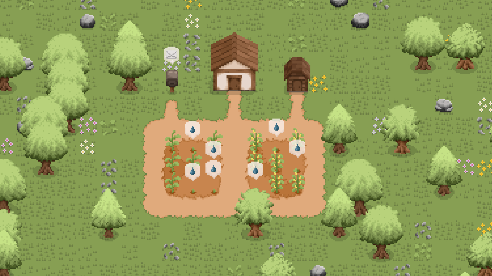

# <p align=center>Little Farmer</p>



> *В вашем распоряжении заброшенный земельный участок размером 56x36 клеток. Развивайте, украшайте и вдохновляйтесь — здесь нет правил, только ваша фантазия!*

Little Farmer - 2D Top-Down пиксельная симулятор фермерства, разработанная на игровом движке Godot при помощи `GDScript`.

## Содержание

- [Основное](./00-intro.md)
- [Строительство](./01-building.md)

## Инструментарий

- Игровой движок: [Godot v4.2.2](https://godotengine.org/download/archive/4.2.2-stable/)
- Графический редактор: [Aseprite](https://aseprite.org/)
- Редактор кода: [Visual Studio Code](https://code.visualstudio.com/)
- Музыкальный редактор: [Fl Studio 12](https://www.image-line.com/)

## Управление

| Кнопка        | Действие       |
| ------------- | -------------- |
| WASD          | Передвижение   |
| ЛКМ/ПКМ       | Взаимодействие |
| Колесико мыши | Зум            |
| Tab           | Инвентарь      |
| Esc           | Меню паузы     |

## Структура проекта

```bash
little-farmer/
├── .docs/                  # <- Вы здесь
│   └── dev/                # Документация для разработчиков
├── assets/
│   ├── data/               # Глобальные данные и функции
│   ├── local/              # Локализация 
│   ├── nodes/              # Игровые объекты
│   ├── resourses/          # Текстуры и шрифты
│   ├── scripts/            # Скрипты
│   ├── shaders/            # Шейдеры Godot
│   └── sounds/             # Игровые звуки и музыка
├── levels/
│   ├── farm.tscn           # Ферма
│   ├── menu.tscn           # Главное меню
│   ├── greenhouse.tscn     # Теплица
│   └── village.tscn        # Деревня
├── .gitignore
├── LICENSE
├── CONTRIBUTING.md
└── README.md
```