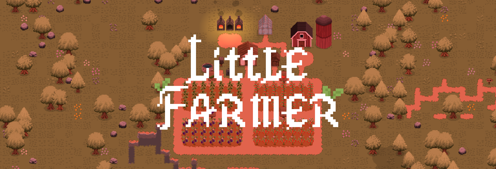
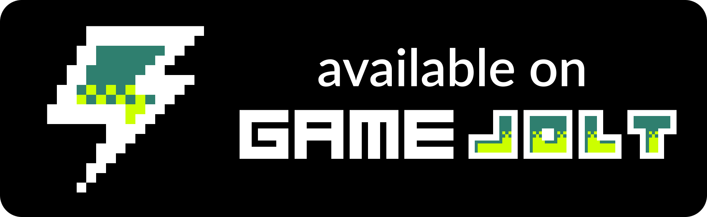

 

> *В вашем распоряжении заброшенный земельный участок размером 56x36 клеток. Развивайте, украшайте и вдохновляйтесь — здесь нет правил, только ваша фантазия!*

Little Farmer - 2D Top-Down пиксельная симулятор фермерства, разработанная на игровом движке Godot v4.2.1 при помощи `GDScript`.

> [!CAUTION]
> Проект находится в состоянии глобального рефакторинга. Большая часть механик может не работать. Спасибо за понимание
> The project is in a state of global refactoring. Most of the mechanics may not work. Thanks for understanding

## Документация

Полноценная документация по каждой механике есть в отдельном разделе [.docs/](.docs/).

## Поддержать

Поддержать разработчика можете купив игру в [VK Play](https://vkplay.ru/play/game/little-farmer/).

| <a href="https://vkplay.ru/play/game/little-farmer/"><a/>  | <a href="https://gamejolt.com/games/littler-farmer/929201"><a/> | <a href="https://miroro.itch.io/little-farmer"><a/> |
| --- | --- | --- | 

